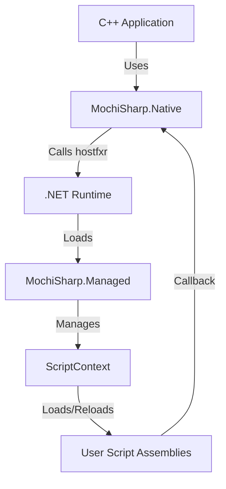

# MochiSharp

MochiSharp is a high-performance .NET hosting framework for C++ applications. It leverages the modern `hostfxr` API to provide a seamless, ultra-fast bridge between native C++ engines and C# script assemblies.

Designed for game engines and performance-critical applications, MochiSharp allows developers to use C# as a powerful scripting layer while maintaining native-level performance and flexibility.

## Key Features

- **Modern .NET Hosting**: Built on the official `hostfxr` hosting API, supporting .NET 6, 7, 8, and beyond.
- **High-Performance Interop**: Uses `[UnmanagedCallersOnly]` for "Reverse P/Invoke," minimizing overhead when calling from C++ to C#.
- **Hot-Reload Support**: Leverages `AssemblyLoadContext` to allow unloading and reloading of script assemblies at runtime without restarting the application.
- **Flexible Method Binding**: Easily bind C++ function calls to C# instance or static methods using a robust signature-based system.
- **Automated Type Discovery**: Find and instantiate all classes deriving from a specific base type (e.g., `GameScript`) within a loaded assembly.
- **Primitive & Struct Support**: Efficiently pass integers, floats, booleans, and complex `Sequential` structs between native and managed code.

## Architecture

MochiSharp consists of two primary components that handle the bridge between native and managed code:



- **MochiSharp.Native**: A C++ static library that encapsulates the hosting logic, initialization, and method invocation.
- **MochiSharp.Managed**: The C# core library that acts as the internal bridge, managing collectible assembly contexts and type marshaling.

## Getting Started

### 1. Scripting (C#)

Define your script classes in a separate C# project. You can use a common base class for easy discovery.

```csharp
namespace MyGame.Scripts;

public class Player : GameScript
{
    private Transform _transform;

    public void OnUpdate(float deltaTime)
    {
        // Script logic here
    }
}
```

### 2. Hosting (C++)

Initialize the host and load your compiled script assembly.

```cpp
#include "MochiSharp/Host.h"

MochiSharp::DotNetHost host;

// 1. Initialize with your runtime config
if (host.Init(L"MyGame.runtimeconfig.json")) {
    
    // 2. Load your script DLL
    host.LoadAssembly("Scripts.dll");

    // 3. Create an instance of a script class
    uint64_t instanceId = 1;
    host.CreateInstance("MyGame.Scripts.Player", instanceId);

    // 4. Bind and Invoke a method
    int updateMethod = host.BindInstanceMethod(instanceId, "OnUpdate", SIG_VOID_FLOAT);
    float dt = 0.16f;
    void* args[] = { &dt };
    host.Invoke(updateMethod, args, 1, nullptr);
}
```

## Building the Project

MochiSharp uses standard CMake/Premake flows for the native side and the .NET CLI for the managed side.

1. **Build Managed Core**:
   ```bash
   dotnet build MochiSharp.Managed/MochiSharp.Managed.csproj -c Release
   ```
2. **Build Native Library**:
   Use your preferred build system (Visual Studio, Make, Ninja) to compile the C++ source in `MochiSharp.Native`.
3. **Run the Example**:
   See the `Example/` directory for a complete working host and script implementation.
